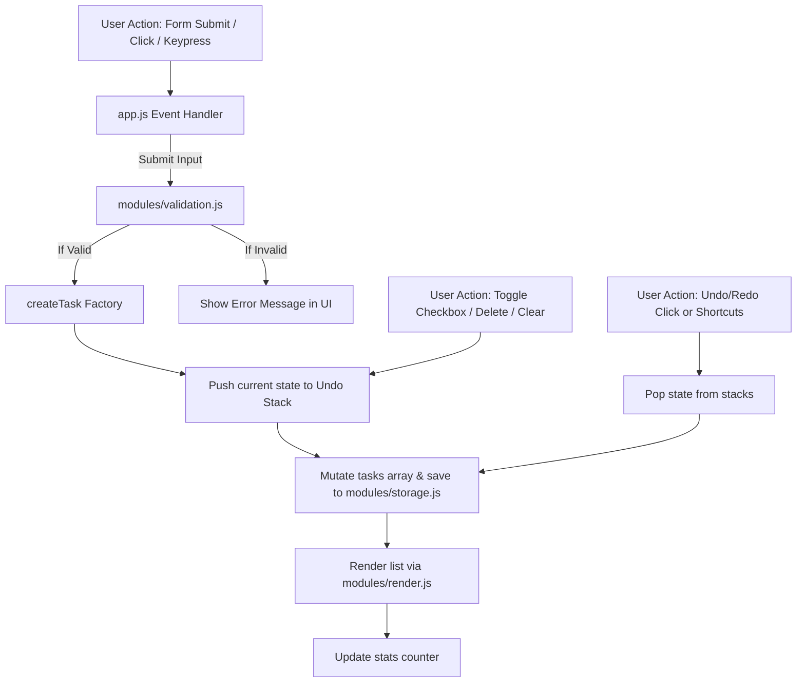

# TaskFlow Lite

TaskFlow Lite is a production-ready, client-side single page task management application built using vanilla JavaScript (ES6+), clean CSS styling, and modular software architecture.

## 🏛️ Architecture Decisions

The project follows a modular, MVC-like (Model-View-Controller) separation of concerns:

- **Model (State & Storage)**: Managed by `modules/storage.js` for reading/writing task array to `localStorage`. The task schema is defined as a plain JavaScript object.
- **View (Rendering & Validation)**: Managed by `modules/render.js` and `modules/validation.js` which update the DOM. XSS prevention is handled using a custom `escapeHTML` function before injecting strings into `innerHTML`.
- **Controller (Wiring & Event Handling)**: Managed by `app.js` which orchestrates inputs, triggers mutations, pushes history states, handles event delegation on the task list container, and updates task statistics counters.

### Performance Optimizations
1. **Document Fragment Batching**: For scaling up to 100+ tasks, the DOM rendering logic leverages `document.createDocumentFragment()` to batch DOM operations, ensuring a render latency under 16ms.
2. **Debounced Validations**: Form inputs are validated on typing with a 300ms debounce to prevent layout shifts or flashing errors on every keystroke.
3. **Event Delegation**: Instead of binding event listeners to individual list items, a single event listener is attached to the parent `#task-list` container.

---

## 💾 LocalStorage Schema

All task data is serialized to JSON and stored under the `tasks` key:

```json
[
  {
    "id": 1700000000000,
    "text": "Learn JavaScript Modules",
    "completed": false,
    "createdAt": "2025-01-15T10:30:00.000Z"
  }
]
```

Theme preferences are stored under the `theme` key (`light` or `dark`).

---

## 🔄 Event Flow Diagram



---

## 💡 Accessibility & Security Features

- **ARIA Attributes**: Elements include correct `aria-label`, `aria-live` for dynamic stats, and `aria-invalid` on input validation errors.
- **Color Contrast**: Designed with high-contrast slate, indigo, and emerald text/borders conforming to WCAG AA guidelines (>= 4.5:1 ratio).
- **Keyboard Navigation**: Users can tab through all interactive controls and operate buttons using Space/Enter. Inside the editing mode, users can press Enter to save and Escape to cancel.
- **XSS Escaping**: User input is strictly escaped before being rendered inside HTML nodes.
